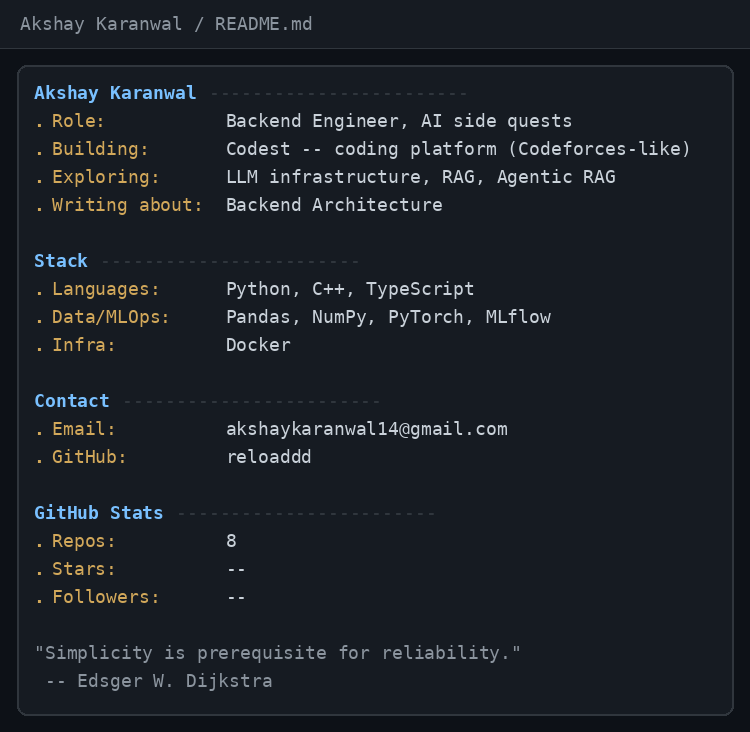

# Hi, I'm Akshay Karanwal
### A Software Engineer building AI projects as side quests

 

  

 

## 🔬 About Me
I am a software engineer specializing in **Backend Development**, and **Artificial Intelligence**. I focus on building robust, deterministic, and highly observable architectures that scale efficiently.
Rather than just writing code, my philosophy is centered around solving problems through clean system design, comprehensive testing, and automated deployments.

* 🏢 Currently building: **Codest -- A complete coding platform like Codeforces**
* 💡 Interested in: **LLM infrastructure, RAG, Agentic RAG**
* 📝 Writing about: **Backend Architecture**

 

## 🛠️ Core Competencies & Tech Stack
I select tools based on the problem at hand, but these are the technologies I utilize most heavily in production environments.

**Languages & Frameworks**

**Data Science & MLOps**

**Infrastructure & Cloud**

 

## 🚀 Featured Engineering Work

| Project | Description | Tech Stack |
|---------|-------------|------------|
| **[Agent-KIRO](https://github.com/reloaddd/Agent-Kiro)** | | `Python`, `VectorDB`, `RAG`, `LLM` |
| **[PNSV](https://github.com/reloaddd/Agent-PNSV)** | | `Python`, `VectorDB`, `GraphRAG`, `Graphs`, `LLM` |
| **[Codest](https://github.com/reloaddd/Codest)** | | `Python`, `Docker`, `Redis`, `Pydantic`, `PostgreSQL` |

 

## 📈 GitHub Activity

  

---

  <i>"Simplicity is prerequisite for reliability." — Edsger W. Dijkstra</i>

